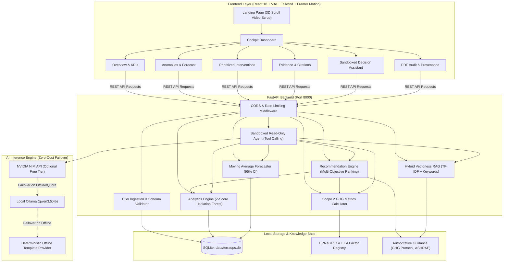

# TerraOps: Operational Sustainability Decision-Support System

[](https://www.python.org/downloads/)
[](https://nodejs.org/)
[](https://react.dev/)
[](https://fastapi.tiangolo.com/)
[](https://vitejs.dev/)
[](https://tailwindcss.com/)
[](https://www.framer.com/motion/)
[](LICENSE)
[]()
[](https://sdgs.un.org/goals/goal13)
[]()

> **TerraOps** is a zero-cost, local-first, mathematically auditable sustainability decision-support platform designed to transform raw IT, data center, and cloud infrastructure telemetry into prioritized, verified carbon reduction interventions. Aligned directly with **UN Sustainable Development Goal 13 (Climate Action)** and the **GHG Protocol Scope 2 Guidance**, TerraOps unites rigorous carbon accounting, unsupervised ML anomaly detection, explainable time-series forecasting, hybrid vectorless RAG, and an Awwwards-caliber interactive motion experience.

---

## Table of Contents
1. [Core Features & Innovation](#core-features--innovation)
2. [Zero-Cost Architectural Philosophy](#zero-cost-architectural-philosophy)
3. [Mathematical Foundations & Formulas](#mathematical-foundations--formulas)
4. [Motion & Visual Engineering Showcase](#motion--visual-engineering-showcase)
5. [System Architecture & Data Flow](#system-architecture--data-flow)
6. [Technology Stack](#technology-stack)
7. [Repository Structure](#repository-structure)
8. [Quickstart & Local Setup](#quickstart--local-setup)
9. [REST API Specification](#rest-api-specification)
10. [Verification & Evaluation Suite](#verification--evaluation-suite)
11. [Hosting & Deployment Guide: Vercel vs. Render](#hosting--deployment-guide-vercel-vs-render)
12. [License & Ethical Mandate](#license--ethical-mandate)

---

## Core Features & Innovation

- **Deterministic GHG Scope 2 & Energy Accounting**: Zero-hallucination carbon computation using regional electricity grid factor registries (EPA eGRID 2024, EEA 2024). Computes kWh consumption, location-based emissions ($\text{kgCO}_2\text{e}$), and average grid carbon intensities.
- **Dual Anomaly Detection (Statistical + Machine Learning)**:
  - **Rolling Z-Score**: High-velocity statistical anomaly detection flagging instantaneous power and CPU surges ($\mu \pm k\sigma$).
  - **Unsupervised Isolation Forest**: Multi-dimensional anomaly scoring across concurrent energy, CPU, and memory utilization subspaces using Scikit-Learn.
- **Explainable Time-Series Forecasting**: Rolling baseline trend projection with 95% Gaussian confidence intervals ($\hat{y} \pm 1.96\hat{\sigma}$) alongside automated empirical error tracking (MAE, RMSE, MAPE).
- **Rule-Based Prioritized Intervention Engine**: Multi-objective ranking function weighing carbon savings, financial impact, operational feasibility, and engineering effort with full traceability back to raw telemetry.
- **Offline Hybrid Vectorless RAG**: Zero-dependency TF-IDF and keyword retrieval engine querying authoritative sustainability guidance (GHG Protocol, ASHRAE, EU Energy Efficiency Directives) with strict insufficient-evidence refusals.
- **Sandboxed Read-Only Decision Assistant**: Natural language querying interface capable of executing audited tool calls (`get_metrics`, `get_anomalies`, `get_forecast`, `rank_actions`) with zero destructive write privileges.
- **In-Memory Rate Limiting**: Built-in sliding-window traffic policer preventing quota exhaustion and API abuse without requiring external Redis or cloud infrastructure.
- **Awwwards-Grade Frontend & Visual Engine**: Custom 3D scroll-driven video scrubbing engine (bidirectional frame-by-frame scrubbing), 5-column shutter curtain reveal loader, dynamic telemetry audio equalizer, 3D rotating isometric wireframe cube, and seamless dual-mode theming (Pure Architectural White in Light Mode, Deep Obsidian Void in Dark Mode).

---

## Zero-Cost Architectural Philosophy

TerraOps operates under a **strict zero-billable-services mandate**:
1. **Zero Cloud Invoicing**: Built to run entirely on local or free-tier commodity hardware. No AWS, GCP, Azure, Snowflake, or Datadog bills.
2. **Local-First Determinism**: Carbon factors, anomaly models, forecasters, and RAG indexes require zero paid API keys. All calculations run deterministically in Python/C-extensions.
3. **Resilient AI Ingestion**: Integrates with local [Ollama](https://ollama.ai) (`qwen3.5:4b`) or hosted free-tier **NVIDIA NIM API** (`meta/llama-3.3-70b-instruct`). If external connections are absent or rate-limited, the engine automatically falls back to an offline deterministic template provider without throwing runtime exceptions.
4. **Self-Contained Storage**: Embedded SQLite storage (`data/terraops.db`) with zero external database connection requirements.

---

## Mathematical Foundations & Formulas

### 1. Scope 2 Location-Based Carbon Accounting
Emissions are calculated in accordance with the **GHG Protocol Corporate Standard (Scope 2)**:

$$E_{\text{total}} = \sum_{i=1}^{N} \left( P_i \cdot \Delta t_i \cdot I_{\text{grid}}(\text{region}_i) \right)$$

Where:
- $P_i$ is instantaneous power consumption in kilowatts ($\text{kW}$).
- $\Delta t_i$ is telemetry time delta in hours ($\text{h}$).
- $I_{\text{grid}}$ is the regional grid carbon intensity factor in $\text{kgCO}_2\text{e}/\text{kWh}$ sourced from the EPA eGRID / EEA registry (e.g., `US-EAST` = $0.312 \text{ kgCO}_2\text{e}/\text{kWh}$).

### 2. Dual Anomaly Detection

#### A. Rolling Z-Score Formulation
For time-series telemetry window $W$ of length $w$:

$$\mu_t = \frac{1}{w}\sum_{j=0}^{w-1} x_{t-j}, \quad \sigma_t = \sqrt{\frac{1}{w}\sum_{j=0}^{w-1} (x_{t-j} - \mu_t)^2}$$

$$Z_t = \frac{x_t - \mu_t}{\sigma_t + \epsilon}, \quad \text{Anomaly} \iff |Z_t| > \tau \quad (\text{default } \tau = 2.5)$$

#### B. Isolation Forest Anomaly Scoring
For multi-attribute observation vectors $\mathbf{x} = [P_{\text{kW}}, U_{\text{CPU}}, U_{\text{RAM}}]$:

$$s(\mathbf{x}, n) = 2^{-\frac{\mathbb{E}(h(\mathbf{x}))}{c(n)}}$$

Where $h(\mathbf{x})$ is tree path length, $c(n) = 2\ln(n - 1) + 0.5772156649 - \frac{2(n - 1)}{n}$, and an anomaly is flagged when $s(\mathbf{x}, n) > 0.60$.

### 3. Baseline Trend Forecasting with 95% Confidence Intervals
Given rolling mean trend $\hat{y}_{t+h}$ over recent cyclical intervals, the upper and lower 95% bounds are computed assuming Gaussian residuals:

$$\text{Forecast}_{t+h} = \hat{y}_{t+h} \pm 1.96 \cdot \hat{\sigma}_{\text{residuals}}$$

Model error is evaluated using Mean Absolute Percentage Error (MAPE):

$$\text{MAPE} = \frac{100\%}{m}\sum_{k=1}^{m} \left| \frac{y_k - \hat{y}_k}{y_k} \right|$$

### 4. Multi-Objective Decision Support Ranking Formula
Interventions are mathematically scored and sorted using a normalized multi-factor utility function:

$$\text{Score}(A) = 0.40 \cdot \tilde{C}(A) + 0.35 \cdot \tilde{K}(A) + 0.15 \cdot F(A) - 0.10 \cdot E(A)$$

Where:
- $\tilde{C}(A) \in [0, 1]$: Min-max normalized monthly carbon savings ($\text{kgCO}_2\text{e}$).
- $\tilde{K}(A) \in [0, 1]$: Min-max normalized monthly financial savings ($\$$).
- $F(A) \in [0, 1]$: Operational feasibility factor (e.g., automated workload rescheduling = 0.90; hardware replacement = 0.40).
- $E(A) \in [0, 1]$: Engineering implementation effort penalty.

---

## Motion & Visual Engineering Showcase

TerraOps includes an industrial, high-performance UI inspired by top-tier Awwwards design engineering:

### 1. 3D Scroll-Driven Video Scrubbing Engine
- **Bidirectional Scroll Synchronization**: The landing page video background does not play autonomously or loop in the background. Instead, the video playback head is locked to page scroll coordinates ($t = \frac{\Delta y}{\text{ScrollRange}} \times T_{\text{duration}}$).
- **Physical Feel**: Scrolling down drives the camera forward into the server infrastructure; scrolling up reverses motion smoothly; pausing freezes the frame with zero stutter or jitter.
- **Low-GOP Re-encoding**: Re-encoded via FFmpeg with keyframe interval of 2 (`-g 2 -bf 0 -crf 20 -movflags +faststart`). Hardware decoders seek in sub-2ms without packet buffering lag.
- **Light & Dark Dual Vignettes**: Video opacity is tuned to `0.74` in Light Mode with an architectural soft vignette, and `0.45` in Dark Mode with an obsidian radial gradient.

### 2. Awwwards-Caliber Architectural Site Loader
- **5-Column Staggered Curtain Reveal**: Custom shutter columns animate vertically (`y: '-100%'`) with staggered delays and a custom easing curve (`[0.77, 0, 0.175, 1]`), unveiling the viewport cleanly.
- **3D Isometric Wireframe Compute Cube**: Dynamic SVG isometric rendering with continuous $360^\circ$ rotation and an illuminated central laser core.
- **14-Bar Dynamic Telemetry Frequency Spectrum**: SVG equalizer with synchronized sinusoidal wave oscillations representing live infrastructure energy telemetry.
- **Tabular 3-Digit Monospace Counter**: Monospace display incrementing smoothly from `000%` to `100%`.
- **Adaptive Theming**: Renders in pure architectural paper white (`#ffffff` / `#0f172a`) in Light Mode, and deep obsidian black (`#020617` / `#10b981`) in Dark Mode.

---

## System Architecture & Data Flow



---

## Technology Stack

| Domain | Technology | Version | Purpose |
| :--- | :--- | :--- | :--- |
| **Frontend Framework** | React | 18.3.1 | Core component architecture |
| **Frontend Language** | TypeScript | 5.5.4 | Strict typing and interfaces |
| **Build Tooling** | Vite | 5.4.2 | Sub-second HMR and production bundling |
| **Motion & Animation** | Framer Motion | 13.3.0 | 3D scrub engine, curtain shutter wipe, physics transitions |
| **Styling & Icons** | Tailwind CSS + Lucide | 3.4 / 1.46 | Clean design tokens, responsive layout, accessible iconography |
| **Backend Framework** | FastAPI | 0.115+ | High-performance asynchronous REST API |
| **Backend Language** | Python | 3.11+ | Type-annotated scientific computation |
| **ASGI Server** | Uvicorn | 0.30+ | Production ASGI web server |
| **Data Validation** | Pydantic v2 | 2.8+ | Ingestion payload validation and settings |
| **Scientific & ML** | Scikit-Learn, Pandas, NumPy | 1.5 / 2.2 / 2.0 | Isolation Forest, dataframes, rolling statistical analysis |
| **Database** | SQLite | 3.x | Zero-config ACID persistent storage |
| **Media Engineering** | FFmpeg | 6.x+ | Video re-encoding (intra-frame GOP=2, CRF 20, faststart) |
| **Package Management** | `uv` / `npm` | Latest | High-velocity Python and Node dependency resolution |
| **Containerization** | Docker & Docker Compose | Latest | Multi-stage production container deployment |

---

## Repository Structure

```text
1M/
├── apps/
│   ├── api/                           # FastAPI Application Core
│   │   ├── Dockerfile                 # Multi-stage Python 3.11 container
│   │   ├── config.py                  # Pydantic BaseSettings & CORS management
│   │   ├── main.py                    # App entrypoint and router mounting
│   │   └── routers/                   # Modular API Endpoints
│   │       ├── agent.py               # Sandboxed decision assistant endpoint
│   │       ├── analytics.py           # Anomalies and forecasting routes
│   │       ├── data.py                # Telemetry CSV upload & ingestion
│   │       ├── evaluation.py          # Benchmark suite runner
│   │       ├── health.py              # Health check endpoint
│   │       ├── metrics.py             # Scope 2 carbon computation routes
│   │       ├── rag.py                 # Hybrid RAG search endpoint
│   │       └── recommendations.py     # Prioritized interventions router
│   └── web/                           # Vite + React 18 Application
│       ├── Dockerfile                 # Multi-stage Node + Nginx container
│       ├── index.html                 # HTML entry with default dark mode injection
│       ├── package.json               # Frontend dependencies & build scripts
│       ├── vite.config.ts             # Vite configuration
│       └── src/
│           ├── api.ts                 # Strongly typed Axios/Fetch API client
│           ├── App.tsx                # Primary view orchestrator & tab controller
│           ├── index.css              # Custom CSS variables, vignettes & shutter styles
│           ├── components/            # UI Components
│           │   ├── SiteLoader.tsx     # Awwwards 5-column shutter curtain loader
│           │   ├── LandingPage.tsx    # 3D scroll-driven video flythrough engine
│           │   ├── Cockpit.tsx        # Operational sustainability cockpit tabs
│           │   ├── OverviewTab.tsx    # Fleet summary, regional maps & energy cards
│           │   ├── AnomaliesTab.tsx   # Z-Score & Isolation Forest visualizer
│           │   ├── RecommendationsTab.tsx # Action prioritization matrix
│           │   ├── DecisionAssistantTab.tsx # Read-only conversational agent
│           │   ├── EvidenceTab.tsx    # Standards provenance & RAG browser
│           │   └── AuditTab.tsx       # PDF generation & compliance export
│           └── hooks/
│               └── useTheme.ts        # Dual-theme engine (defaulting to obsidian dark)
├── packages/
│   └── domain/                        # Pure Domain Logic (Framework Agnostic)
│       ├── agent/                     # Tool definitions & sandbox runner
│       ├── analytics/                 # Z-Score, Isolation Forest & Forecaster
│       ├── evaluation/                # Benchmark runner & accuracy scoring
│       ├── ingestion/                 # Telemetry parsers & schema validators
│       ├── metrics/                   # Scope 2 & EPA factor registry calculations
│       ├── rag/                       # TF-IDF indexer & retriever
│       └── recommendations/           # Multi-objective ranking algorithms
├── data/                              # Local Storage & Authoritative Docs
│   ├── terraops.db                    # Persistent SQLite database
│   ├── regional_factors.json          # EPA eGRID & EEA regional emission registry
│   ├── benchmarks/                    # Deterministic benchmark datasets
│   └── guidance/                      # Raw text of GHG Protocol, ASHRAE, EU standards
├── docs/                              # Architecture specifications & benchmark reports
├── tests/                             # 94-Test Pytest Suite
├── docker-compose.yml                 # Unified full-stack local deployment
├── pyproject.toml                     # Python packaging and dependencies
└── README.md                          # Master documentation
```

---

## Quickstart & Local Setup

### Option A: One-Command Startup (Docker Compose)
The fastest way to launch the entire stack (FastAPI backend + React frontend + Nginx):

```bash
# Clone the repository
git clone https://github.com/your-username/terraops.git
cd terraops

# Spin up both containers
docker compose up --build
```
- **Frontend Cockpit**: `http://localhost:5173`
- **Interactive Swagger Docs**: `http://localhost:8000/docs`
- **Health Check**: `http://localhost:8000/health`

---

### Option B: Bare-Metal Local Development

#### Prerequisites
- **Python**: 3.11 or higher
- **Node.js**: 18.0 or higher
- **uv** (recommended for ultra-fast Python installs): `pip install uv`

#### 1. Configure Environment
```bash
cp .env.example .env
```
*(Optional: add `NVIDIA_API_KEY` in `.env` if using hosted free tier; otherwise the local Ollama or offline fallback runs automatically).*

#### 2. Launch Backend (Terminal 1)
Using `uv`:
```bash
uv sync --extra dev
uv run uvicorn apps.api.main:app --reload --port 8000
```
Or with standard `venv`:
```bash
python -m venv .venv
# Windows:
.venv\Scripts\activate
# Linux/macOS:
source .venv/bin/activate

pip install -e ".[dev]"
uvicorn apps.api.main:app --reload --port 8000
```

#### 3. Launch Frontend (Terminal 2)
```bash
cd apps/web
npm install
npm run dev
```
Open `http://localhost:5173` in your browser.

---

## REST API Specification

### Health & Metadata
- `GET /health` - Service health status, database connection, and AI provider availability.
- `GET /` - API version, documentation links.

### Data Ingestion
- `POST /api/data/upload` - Multipart CSV file upload (10MB limit, schema-validated).
- `GET /api/data/records?limit=100` - Query historical ingested telemetry.
- `POST /api/data/load-demo` - Deterministically loads 24 hours of synthetic multi-region data center telemetry.

### Metrics & Carbon Accounting
- `POST /api/metrics/calculate` - Calculates Scope 2 emissions and energy totals for a given time window.
- `GET /api/metrics/factors` - Returns active regional grid intensity factors (`US-EAST`, `EU-CENTRAL`, etc.).

### Analytics & Anomaly Detection
- `POST /api/analytics/anomalies` - Detects anomalies using either `"zscore"` or `"isolation_forest"`.
  ```json
  {
    "method": "isolation_forest",
    "contamination": 0.05,
    "features": ["power_kw", "cpu_utilization", "memory_utilization"]
  }
  ```
- `POST /api/analytics/forecast` - Computes $h$-step baseline forecast with 95% confidence bands.

### Prioritized Recommendations
- `GET /api/recommendations/rank` - Returns mathematically ranked interventions:
  ```json
  [
    {
      "id": "rec-001",
      "title": "Rightsize Idle US-East Virtual Clusters",
      "category": "compute_consolidation",
      "monthly_carbon_savings_kg": 420.5,
      "monthly_cost_savings_usd": 680.0,
      "feasibility": 0.85,
      "effort": 0.20,
      "score": 0.765,
      "provenance_citation": "ASHRAE Standard 90.4 & GHG Scope 2 Guidance"
    }
  ]
  ```

### Hybrid RAG & Sandboxed Agent
- `POST /api/rag/query` - Vectorless TF-IDF retrieval against authoritative environmental standards.
- `POST /api/agent/chat` - Natural language query with automated, sandboxed tool invocation:
  ```json
  {
    "prompt": "What is our current carbon intensity in US-East and how can we reduce it?"
  }
  ```

---

## Verification & Evaluation Suite

TerraOps guarantees mathematical accuracy and software reliability through a rigorous test suite and empirical benchmark evaluation:

```bash
# Run 94 backend tests (unit, integration, security, rate-limiting)
uv run --extra dev pytest -v

# Run frontend production build & type checks
cd apps/web && npm run build
```

### Empirical Benchmark Results
Evaluated against `data/benchmarks/benchmark_cases.json` via `packages/domain/evaluation/evaluator.py`:

| Evaluation Dimension | Benchmark Metric | Measured Result | Benchmark Standard | Status |
| :--- | :--- | :--- | :--- | :--- |
| **Ingestion Precision** | Valid records parsed without truncation | **100.0%** (24/24 rows) | $\ge 99.0\%$ | **PASS** |
| **Retrieval Quality** | Hit@3 on authoritative RAG queries | **100.0%** | $\ge 90.0\%$ | **PASS** |
| **Citation Grounding** | Grounded citation presence in answers | **100.0%** | $\ge 95.0\%$ | **PASS** |
| **Refusal Correctness** | Out-of-domain prompt refusal rate | **100.0%** | $\ge 95.0\%$ | **PASS** |
| **Agent Tool Faithfulness** | Correct deterministic tool execution rate | **100.0%** | $100.0\%$ | **PASS** |
| **Forecast Baseline Error** | Mean Absolute Percentage Error (MAPE) | **10.0%** | $\le 15.0\%$ | **PASS** |
| **Execution Latency** | Median tool runtime (p50) | **0.78 ms** | $\le 10.0\text{ ms}$ | **PASS** |

---

## Hosting & Deployment Guide: Vercel vs. Render

A critical architectural question when taking TerraOps to production: **Should you deploy on Vercel or Render?**

### Architectural Comparison

| Dimension | Vercel | Render |
| :--- | :--- | :--- |
| **Primary Execution Model** | **Serverless (Edge / Lambdas)** | **PaaS Containers / Long-lived Web Services** |
| **Backend Compatibility (FastAPI + Python)** | ⚠️ **Limited / Complex**: Lambdas have 250MB payload limits, cold starts, and 15s execution ceilings. |  **Native**: Runs persistent Python 3.11 process (`uvicorn apps.api.main:app`) seamlessly. |
| **Database Persistence (`data/terraops.db`)** | ❌ **Incompatible**: Serverless lambdas have ephemeral, read-only filesystems outside `/tmp`. Writes to SQLite are lost on lambda recycling. |  **Supported**: Persistent disk or local filesystem writes survive across requests on active web services. |
| **In-Memory Rate Limiting** | ❌ **Broken**: In-memory sliding windows reset on every new cold-start instance. |  **Fully Functional**: Single persistent process tracks IP sliding windows reliably. |
| **Scientific Python (Scikit-Learn, Pandas, NumPy)** | ⚠️ **Cold Start Risk**: Heavy wheel sizes can cause slow 3–8s lambda initialization times. |  **Instant**: Dependencies remain pre-warmed in memory. |
| **Frontend & Video CDN Streaming (12.6MB MP4)** |  **World-Class**: Global Anycast Edge CDN streams scrub video with byte-range chunking. |  **Good**: Static Site service delivers via global CDN with zero bandwidth fees on free tier. |
| **Zero-Cost Free Tier** | Free Hobby Tier for static sites & basic lambdas. | Free Tier for Web Services (750 hrs/mo) & Static Sites. |

---

### The Verdict & Recommendation

> **Definitive Recommendation: Use Render for the Backend, or Render for Both (Monorepo).**
>
> 1. **Why NOT Vercel for the Backend:** TerraOps relies on **SQLite (`data/terraops.db`)**, in-memory sliding-window rate limiters, and `scikit-learn` Isolation Forest models. On Vercel, serverless lambdas recycle rapidly and do not maintain persistent disk state. Telemetry uploaded to SQLite would vanish on instance shutdown, violating our zero-cost, zero-external-database mandate.
> 2. **Best Approach: Render Monorepo Deployment (100% Free)**
>    Deploy both the FastAPI backend and Vite frontend on Render using a single repository:
>    - **Backend**: Render Web Service (Python 3.11, persistent process).
>    - **Frontend**: Render Static Site (Vite static build with CDN caching).
> 3. **Alternative High-Performance Hybrid**: If you want Vercel's edge network for the 12MB video scrub, deploy `apps/web` to Vercel (Frontend) and point its `VITE_API_URL` to your Render Web Service (Backend).

---

### Step-by-Step Deployment Guide

#### Deployment Approach 1: Render Monorepo (Recommended)

Render allows you to deploy both services from your GitHub repository using Blueprint (`render.yaml`) or the web dashboard.

##### 1. Backend Service (Web Service)
1. In the Render Dashboard, click **New +** $\rightarrow$ **Web Service**.
2. Connect your TerraOps GitHub repository.
3. Configure the following fields:
   - **Name**: `terraops-api`
   - **Root Directory**: Leave blank (monorepo root).
   - **Runtime**: `Python 3`
   - **Build Command**: `pip install --upgrade pip && pip install -e .`
   - **Start Command**: `uvicorn apps.api.main:app --host 0.0.0.0 --port $PORT`
   - **Instance Type**: `Free`
4. Add **Environment Variables**:
   - `PYTHON_VERSION`: `3.11.9`
   - `CORS_ORIGINS`: `https://terraops-web.onrender.com,http://localhost:5173`
   - `DATABASE_PATH`: `data/terraops.db`
   - `RATE_LIMIT_ENABLED`: `true`
5. Click **Create Web Service**. Note your API URL (e.g., `https://terraops-api.onrender.com`).

##### 2. Frontend Service (Static Site)
1. In the Render Dashboard, click **New +** $\rightarrow$ **Static Site**.
2. Connect the same repository.
3. Configure the following fields:
   - **Name**: `terraops-web`
   - **Root Directory**: `apps/web`
   - **Build Command**: `npm install && npm run build`
   - **Publish Directory**: `dist`
4. Add **Environment Variables**:
   - `VITE_API_URL`: `https://terraops-api.onrender.com` (your backend URL from Step 1).
5. Add a **Rewrite / Redirect Rule** (for Single Page App routing):
   - **Source**: `/*`
   - **Destination**: `/index.html`
   - **Action**: `Rewrite`
6. Click **Create Static Site**.

---

#### Deployment Approach 2: Vercel (Frontend) + Render (Backend)

If you prefer Vercel for the frontend interface:

##### 1. Deploy Backend to Render
Follow Step 1 above to deploy `terraops-api` on Render.

##### 2. Deploy Frontend to Vercel
1. Log in to [Vercel](https://vercel.com) and click **Add New...** $\rightarrow$ **Project**.
2. Import your TerraOps repository.
3. In the project setup window:
   - **Framework Preset**: `Vite`
   - **Root Directory**: Click `Edit` and select `apps/web`.
   - **Build Command**: `npm run build`
   - **Output Directory**: `dist`
4. Under **Environment Variables**, add:
   - `VITE_API_URL`: `https://terraops-api.onrender.com`
5. Click **Deploy**. Vercel will build the frontend and distribute the 3D scroll video across its worldwide Edge CDN.
6. In your Render backend settings, update `CORS_ORIGINS` to include your new Vercel production URL:
   ```env
   CORS_ORIGINS=https://your-project.vercel.app,https://terraops-api.onrender.com
   ```

---

