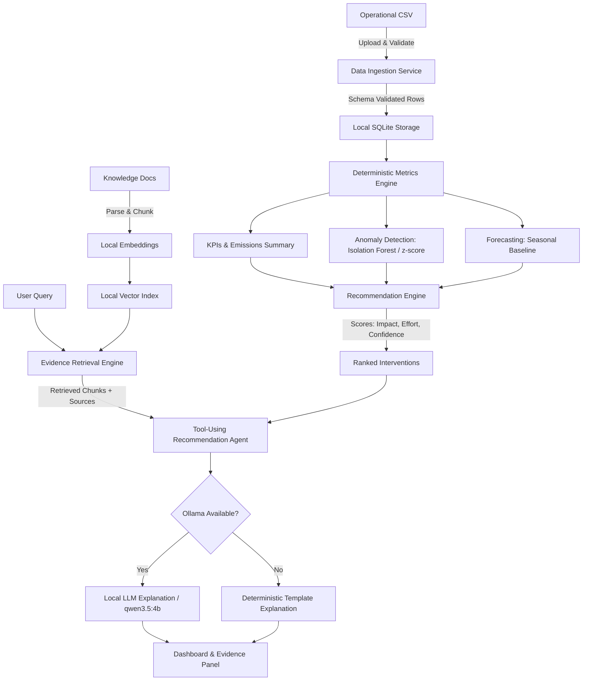

# TerraOps Technical Assessment

## 1. Executive Summary & Repository State
- **Repository Path**: `c:\Users\hardi\Downloads\1M`
- **Current Repository State**:
  - Git repository initialized at commit `d0b8f1e` (`origin/main`).
  - Contains `.gitignore` with Python, Node, data, and secret exclusions.
  - Contains complete `.agents/` project specifications, rules, and builder skill.
  - Clean state: No application code, previous databases, or uncommitted code files exist currently.
- **Environment Diagnostics**:
  - **Operating System**: Windows 11 (NT 10.0.26200.0)
  - **Python**: Python 3.13.7 (default) and Python 3.11 available
  - **Package Manager (Python)**: `uv` 0.11.0 installed and on PATH; standard `pip`/`venv` supported
  - **Node.js**: v22.16.0
  - **Package Manager (Node)**: `npm` 10.9.2 installed
  - **Containers**: Docker CLI 29.2.0 and Docker Compose v5.0.2 present (Docker daemon currently inactive)
  - **Local AI / LLM**: Ollama 0.33.3 is active and listening on port 11434 with local models pre-installed (`qwen3.5:4b` [3.4 GB], `nomic-embed-text` [274 MB], `nemotron-3-nano:4b` [2.8 GB], etc.)
  - **Local Ports**: Port 5432 (PostgreSQL) and Port 11434 (Ollama) active; Ports 8000 (FastAPI target) and 5173 (Vite target) are free.

---

## 2. Zero-Cost Enforcement Baseline (₹0 Requirement)
The TerraOps product is built strictly under the ₹0 mandatory expenditure rule:
- **No Paid APIs**: No OpenAI, Anthropic, or proprietary cloud model API keys are required or assumed.
- **No Paid Cloud Infrastructure**: Local execution is the first-class citizen.
- **Open-Source Tooling**: Standard open-source stack (FastAPI, React/Vite, SQLite, scikit-learn, FAISS/in-memory vector store, Ollama).
- **Graceful Fallbacks**: The system operates with full analytical and recommendation capability even when no LLM runtime or external provider is present.

---

## 3. Proposed Technology Stack

| Layer | Selected Technology | Rationale & Zero-Cost Status |
| :--- | :--- | :--- |
| **Backend API** | FastAPI (Python 3.11+) | Asynchronous, typed, auto-generates OpenAPI docs, fast execution |
| **Data Processing & ML** | pandas / polars, scikit-learn, numpy | Open-source, deterministic numerical calculations, Isolation Forest / rolling z-score |
| **Frontend Web** | React 18/19 + TypeScript + Vite | Lean, lightning-fast HMR, component-driven, zero external dependencies |
| **Styling & Design** | Modern Vanilla CSS / CSS Modules | Rich, responsive design with zero framework lock-in and high performance |
| **Primary Database** | SQLite (`data/terraops.db`) | Zero-configuration, file-based, completely free, highly portable |
| **Vector Store / Retrieval** | Local in-memory FAISS / Vector index | Zero-cost semantic search over local knowledge chunks |
| **Embeddings** | `nomic-embed-text` (Ollama) or local sentence-transformers | Fully local embeddings without external network calls |
| **Local LLM Adapter** | Ollama API (`http://localhost:11434`) | Uses local `qwen3.5:4b` with a hard fallback to no-LLM mode |
| **Testing** | pytest, pytest-asyncio, httpx, Vitest | Fast, deterministic automated tests with mock boundaries |
| **Containerization** | Docker Compose | Multi-stage Dockerfile for API and Web services |

---

## 4. Architecture & Modularity

Per `.agents/spec/architecture.md`, we adopt a **Modular Monolith** structure:

```text
1M/
├── apps/
│   ├── api/                     # FastAPI backend application
│   │   ├── main.py              # Entrypoint and app initialization
│   │   ├── routers/             # HTTP route handlers (health, data, metrics, recommendations, rag, agent)
│   │   ├── schemas/             # Pydantic request/response models
│   │   └── dependencies.py      # DI providers for services and repositories
│   └── web/                     # React + TypeScript Vite frontend
│       ├── src/
│       │   ├── components/      # UI components (KPIs, charts, recommendations, evidence)
│       │   ├── api/             # Typed API client
│       │   └── pages/           # Dashboard and evaluation views
│       └── package.json
├── packages/
│   ├── domain/                  # Core domain logic & interfaces
│   │   ├── models/              # Pure domain entities (Facility, Metric, Anomaly, Recommendation)
│   │   ├── metrics/             # Deterministic carbon/energy formula implementations
│   │   ├── analytics/           # Anomaly detector & baseline forecaster
│   │   ├── recommendations/     # Rule/template-based ranking engine
│   │   └── rag/                 # Chunker, retriever, and context assembler
│   └── shared/                  # Config, constants, and logging utilities
├── data/
│   ├── demo/                    # Synthetic deterministic operational CSVs
│   ├── factors/                 # Versioned emission and carbon intensity factors (JSON/YAML)
│   └── knowledge/               # Versioned markdown policy/efficiency documents
├── tests/
│   ├── unit/                    # Unit tests for calculations, schemas, and scoring
│   ├── integration/             # API endpoint and storage integration tests
│   └── e2e/                     # End-to-end user journey tests
├── docs/                        # Project documentation and agent state
├── docker-compose.yml
├── .env.example
└── README.md
```

### Explicit Interface Contracts
- `LLMProvider`: Adapter protocol exposing `generate(prompt: str, context: dict) -> str` and `health() -> bool`.
- `EmbeddingProvider`: Adapter protocol exposing `embed_text(text: str) -> list[float]`.
- `VectorStore`: Protocol for adding documents and querying top-k nearest neighbors.
- `DataRepository`: Storage abstraction for ingested operational records.
- `FactorRepository`: Versioned lookup for regional carbon intensity and emission coefficients.
- `RecommendationEngine`: Deterministic intervention ranker.

---

## 5. End-to-End Data Flow



---

## 6. AI, Local Models & RAG Strategy
- **Numeric Calculations**: Strictly isolated in pure Python functions with deterministic tests. No LLM will ever perform or hallucinate emission math, cost calculations, or ranking scores.
- **RAG Implementation**:
  - Markdown source documents stored in `data/knowledge/` with verified metadata (title, local ID, publisher, effective date).
  - Indexed locally using `nomic-embed-text` (via active Ollama service) or standard local embeddings.
  - Queries match top-k chunks with similarity thresholds; low-confidence queries return explicit "insufficient evidence" warnings.
- **Recommendation Agent**:
  - Strict tool allowlist (`get_metrics`, `get_anomalies`, `get_forecast`, `search_knowledge`, `estimate_impact`, `rank_interventions`).
  - Read-only execution policy; no destructive or system mutation operations exist.
- **No-LLM Fallback**:
  - If Ollama is offline or model fails to load, the API and UI automatically serve pre-rendered structured templates without degrading data or analytical features.

---

## 7. Testing & Quality Strategy
- **Unit Testing**: Pytest suite covering CSV parsing, edge-case validation, factor arithmetic, z-score anomaly detection, baseline forecasting, and prompt construction.
- **Integration Testing**: HTTP tests via `httpx.AsyncClient` validating API endpoints, response schemas, and database transactions.
- **Evaluation Set**: JSON benchmark fixtures evaluating retrieval accuracy, source citation presence, and calculation reproducibility.
- **Deterministic Fixtures**: Fixed random seeds for synthetic data generation and mock adapters for external model boundaries.

---

## 8. Deployment Strategy
- **Primary Target**: Local developer execution via `uv run` and `npm run dev`.
- **Secondary Target**: Local containerized orchestration via `docker-compose.yml` (multi-container: `api` + `web`).
- **Optional Public Demo**: Static frontend hosting (e.g. GitHub Pages / Vercel free tier) with container backend, or single container demo profile. Zero spend verified prior to any deployment setup.

---

## 9. Risks, Unknowns & Human Decisions

### Risks & Mitigations
1. **Model Latency**: Local LLM generation on CPU/GPU can vary in speed.
   - *Mitigation*: Cap generation tokens, keep context budgets tight, and provide non-blocking UI loading states.
2. **Environment Port Conflicts**: Existing PostgreSQL on port 5432.
   - *Mitigation*: Use SQLite by default; no conflict occurs.

### Unknowns & Decisions Required
- **None at this stage**: All dependencies for Phase 1 Bootstrap are free, locally available, and verified.
- Proceeding to Phase 1 requires no external credentials or human-only actions.
